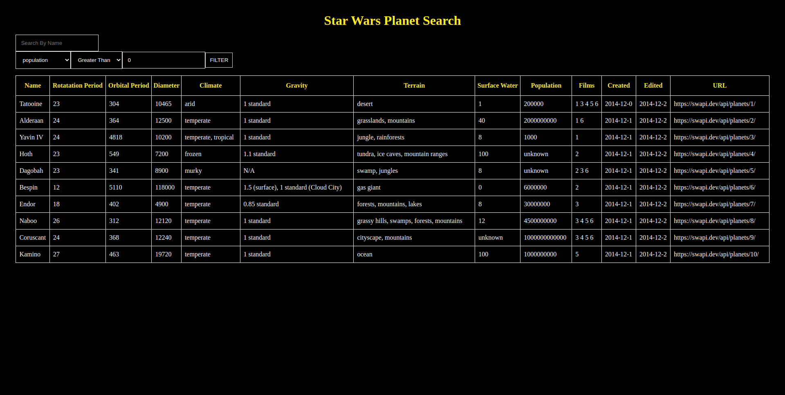

# Context API Star Wars Planet Search

- In this project, I developed a simple filter for Star Wars planets
- Used the free API https://swapi.dev/api/planets to get planets data
- Project was made in March 2022 as a part of [Trybe's Front-end Course](https://www.betrybe.com/)

# How to Install
You can use any of the methods to install.

To test it, go to http://localhost:3000/

  
<strong>Locally</strong>

  1. `npm install`
  2. `npm start`

  
<strong>Docker</strong>

  1. `docker-compose up -d` &rarr; to install container and run project

# Project features and images
- Single page showing a table with data from the Star Wars planets project
- Name and data filters

